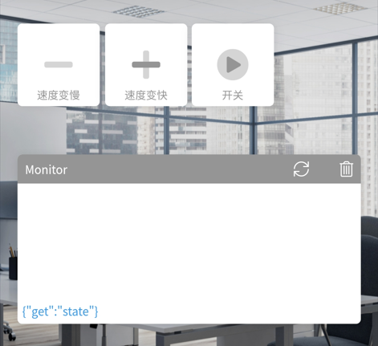

# Inertia Screen 惯性筛

**机电一体化课程设计—惯性筛**

> 本项目是为了完成机电一体化课程设计而制作的，在参考了大量的机构后，选择了一个较容易实现且较为美观的设计——偏心轮机构。

另外，在制作完成后发现了一些问题也在这里列举一下：

* **惯性筛的筛动速度问题**，本着节省成本的想法，选用了3.3v~9v 出轴8mm的N20直流电机，但是在使用后一个很明显的问题就是速度，因为自己制作的电路板（V1版本，在更新V2版本的时候忘记备份了。。所以成本上去了，但是V2版本可以做循迹小车，可以遥控的那种）的缘故，电压最高只能给到5V，所以转速基本上是1圈/秒，室友看后直称“老奶奶筛”。
* **惯性筛的稳定性及配合问题**，所有零件在安装完成后会与仿真图有很大出入，所以在安装的时候尽量保持零件之间的位置关系例如垂直及距离等，尤其是轴和轴配合的同心度也就是零件精度，会直接影响到后面运行时的稳定程度，**电机上方最好也压一下或者胶枪封一下，不然电机会上下跳动。**
* **零件的打印问题**，其余的都还好，机架长得~~太弯吧~~了，打印的时候加了不少支撑（支撑比模型还坚挺我是真的跪了orz，直接喜提战损版皮肤，~~胶枪粘~~），筛网下方区域是为了**预留空间给收集装置。**
* **一代电路板的问题**，开关的封装用错了导致后来的飞线，在最后我的实物展示图中可以看到，最大的问题是电路板的D7引脚，不知为何，在单独测试过程中输出正常，安装在电路板上时，无论输出高低电平，输出电压都为1.5V造成了很大的问题，我的解决方案是：因为这种结构的惯性筛并不需要正反转控制，所以直接**将D7飞线接地**，就解决了这个问题。

> 建模软件为Inventor而非SolidWorks，是因为我想要向Fusion 360及Inventor建模软件转的缘故，但是我都预留了转换好的Step模型方便大家使用。

> 关于课设要求交的各类文件，我都放在了4.Docs文件夹中，包括了仿真动画、说明书、答辩PPT和电路原理图等也方便大家参考。

---

### 电路部分

关于建模什么的我在这里就不多bb了，会的都会，不会的直接打印。

而关于电路和程序部分我需要单独讲一下，先是电路，由于操作失误一代也就是我现在使用的并没有保留下来但是原理图还是有的。**原理图中有部分错误已经在上文列出。**

> 主要用到的元器件为（元器件皆可在淘宝店铺[优信电子](https://youxin-electronic.taobao.com/shop/view_shop.htm?spm=a230r.1.14.4.35ac24c9mNoVBK&user_number_id=2658592015)买到）：
>
> 1. D1 Mini 开发板（主控）
> 2. SH1.0mm 2P 的插头接口
> 3. FM116B 单路直流电机驱动器
> 4. 滑动变阻器（硬件调速使用）3296W-5KΩ
> 5. 贴片滑动开关

二代图纸为改进版本，主要为了下学期的课设循迹小车准备的，在制作时同样会开源，可以在我的主页寻找，该电路可以使循迹小车还拥有遥控模式，同样采用N20，运转速度慢，但可以作为小玩具在答辩后玩。

具体的电路元器件需要什么我就不在这里列举了，感兴趣的可以下载后查看。

### 程序部分

程序方面，使用的是Arduino，环境使用的Visual Studio平台下的Visual Micro，也可以使用VS Code的PlatformIO进行开发。

在代码中加入了Blinker库，用于远程手机控制（**点灯Blinker APP**），**要注意将密钥及Wifi等设置为自己的。**

**有能力的小伙伴可以将速度变快变慢的按钮换成滑块，能更好的控制速度，会丝滑很多。**

### 实物展示

下面放一下我做好的实物图：

